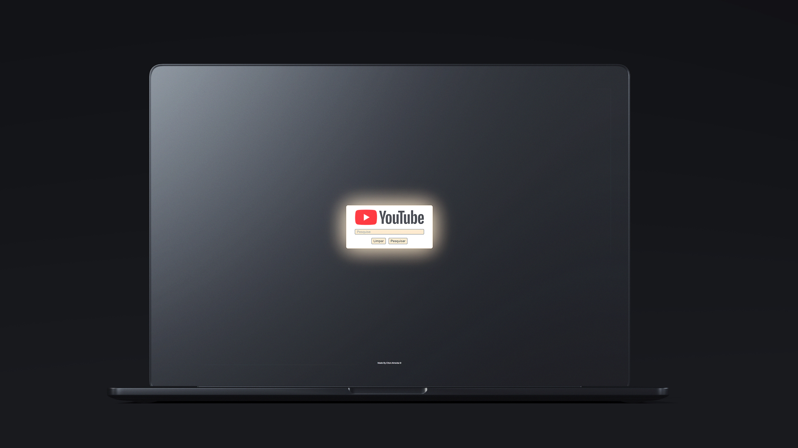

<h1>Home Page do YouTube</h1>

  

<h2 align="center">
  Acesse a Home do YouTube Clicando <a target="_blank" href="#">AQUI</a>!
</h2>

  <a href="#clipboard-sobre-o-projeto">Sobre o Projeto</a>&nbsp;&nbsp;&nbsp;|&nbsp;&nbsp;&nbsp;
  <a href="#computer-tecnologias-utilizadas">Tecnologias</a>

## :clipboard: Sobre o Projeto
Esse projeto é uma homepage minimalista do YouTube.
Através dela você consegue pesquisar qualquer vídeo que tenha na plaforma original.

## :computer: Tecnologias utilizadas

O projeto foi desenvolvido utilizando as seguintes tecnologias:

- HTML
- CSS
